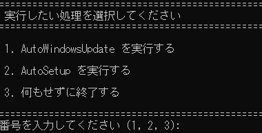

# Windows PC キッティング自動化スクリプト

Windows PCのキッティング（初期セットアップ）から開発環境構築までの一連の作業を自動化するPowerShellスクリプト群です。

**`recipe.yaml`** に設定を定義するだけで、手作業による時間のかかるセットアップ作業を大幅に削減し、誰でも一貫性のある環境を迅速に構築できます。

<p align="center">

</p>

## 主な機能

- **Windows Updateの完全自動化**: 更新プログラムがなくなるまで、確認・インストール・再起動を無人で繰り返します。
- **柔軟なアプリケーション管理**: `winget` を利用し、`recipe.yaml` に基づいてアプリの一括インストールや不要なプリインストールアプリの削除を行います。
- **開発環境の自動構築**: `recipe.yaml` で定義された `code` (VSCode拡張機能)、 `npm` (Node.js) 、 `pip` (Python) などのパッケージマネージャーを通じて、開発用ライブラリを一括でインストールします。
- **設定ファイルによる柔軟なシステム構築**: エクスプローラーの拡張子表示などのシステム設定を`recipe.yaml`に直接記述することで、スクリプトを編集することなく柔軟に設定を変更できます。
- **安定した2フェーズ実行**: アプリインストール（フェーズ1）と、PATH環境変数を参照する開発ツール（フェーズ2）の間に再起動を挟むことで、安定した動作を保証します。
- **対話的な操作メニュー**: `Start-Admin.bat` を実行するだけで、ユーザーはメニューから実行したい処理を簡単に選択できます。

## 推奨ワークフロー

1.  **OSのクリーンインストール**: Windows 11をクリーンインストールします。
2.  **リポジトリの配置**: このリポジトリのファイルをPCの任意の場所（例: `C:\Work`）に配置します。
3.  **設定ファイルの編集**: `recipe.yaml` をテキストエディタで開き、不要な項目を行頭に `#` を付けてコメントアウトし、自分の好みに合わせて編集します。
4.  **スクリプトの実行**:
    1.  `Start-Admin.bat` を**右クリック**し、「**管理者として実行**」を選択します。
    2.  メニューから `1. AutoWindowsUpdate` を選択し、OSを最新の状態にします。（**強く推奨**）
    3.  処理が完了したら、再度 `Start-Admin.bat` を管理者として実行します。
    4.  メニューから `2. AutoSetup` を選択し、アプリケーションのインストールと環境構築を開始します。
5.  **最終確認**:
    - すべての自動処理が完了したら、PCを一度手動で再起動します。
    - Windows Updateの画面やデバイスマネージャーを開き、更新漏れや不明なデバイスがないか最終確認を行います。

## スクリプト構成

| ファイル名 | 役割 |
|---|---|
| `Start-Admin.bat` | **起点となるファイル。** 管理者権限を確認し、対話形式で実行するスクリプトを選択させます。（メモ帳などで開くと文字化けすることがありますが、実行には影響ありません） |
| `AutoWindowsUpdate.ps1` | Windows Updateを全自動で実行します。更新がなくなるまで、更新の確認・インストール・再起動を繰り返します。 |
| `AutoSetup.ps1` | `recipe.yaml` に基づき、アプリのインストール、システム設定、開発環境の構築を2フェーズ（再起動を挟む）に分けて実行します。 |
| `recipe.yaml` | **カスタマイズの中心。** インストールするアプリ、システム設定、開発パッケージなどを、コメント付きで分かりやすく定義します。 |
| `template-recipes/` | `recipe.yaml` のテンプレート集。代表的な構成例をフォルダ単位で保持し、必要に応じてコピーして利用できます。 |
| `キッティング手順.txt` | 自動化スクリプトを使用する際の、手動作業を含めた全体的な作業フローのメモです。 |
| `ツール未対応の設定手順覚書き/` | スクリプトによる自動化範囲外の、各種手動設定に関する手順書が格納されています。（例: Hyper-V、WSL2のセットアップなど） |

## カスタマイズ

セットアップ内容は `recipe.yaml` を編集することで自由にカスタマイズできます。不要な項目は行頭に `#` を付けてコメントアウトしてください。

### フェーズ1 (`phase1`)

再起動前に実行される基本的なシステムセットアップを定義します。

- `windowsSettings`: レジストリ変更を伴うシステム設定を、`description`と`command`キーで定義します。
- `wingetInstall`: `winget` でインストールするアプリのIDと、必要に応じてインストールオプションを記述します。
- `appxRemove`: 削除したいWindows標準アプリの名称（ワイルドカード使用可）を記述します。

### フェーズ2 (`phase2`)

再起動後に実行される開発者向けパッケージのインストールを定義します。

- `packageManagers`: 複数のパッケージマネージャーをリスト形式で定義します。
  - `managerName`: ログに表示される管理ツールの名前です（例: 'npm', 'pip'）。
  - `checkCommand`: パッケージがインストール済みか確認するためのコマンドです。`{package}` というプレースホルダーがパッケージ名に置換されます。
  - `installCommand`: パッケージをインストールするためのコマンドです。`{package}` が置換されます。
  - `packages`: このマネージャーでインストールするパッケージのリストです。

**設定例 (`recipe.yaml`):**
```yaml
phase2:
  packageManagers:
    # --- VSCode (拡張機能) ---
    - managerName: 'vscode'
      checkCommand: 'code --list-extensions | findstr /i /c:"{package}"'
      installCommand: 'code --install-extension {package}'
      packages:
        # [UI / 表示]
        - description: 'UIの日本語化'
          name: ms-ceintl.vscode-language-pack-ja
        - description: 'インデントを色付け'
          name: oderwat.indent-rainbow
        - description: '全角スペースをハイライト'
          name: mosapride.zenkaku
        - description: '行末の不要な空白をハイライト'
          name: shardulm94.trailing-spaces
        - description: 'コメントを種類別に色分け'
          name: aaron-bond.better-comments
        - description: 'エラー/警告を行内表示'
          name: usernamehw.errorlens
        - description: 'EditorConfig（書式統一）'
          name: EditorConfig.EditorConfig
```

## テンプレートレシピの活用

`template-recipes/` ディレクトリには、フェーズや目的別に分かれたサンプル `recipe.yaml` が格納されています。`step1_only_basic/` のようにフェーズ1のみを含む最小構成から、`step1_only_dev/` のような本格的な開発者向け環境、 `step2_VSCode/`や`step2_Rust/` のように開発言語・ツール別の拡張セットまで揃っています。環境構築のたたき台がほしい場合は、近い構成のテンプレートをリポジトリ直下にコピーし、自分の要件に合わせて調整してから `AutoSetup.ps1` を実行してください。

## Winget Configurationとの違い

Microsoftが提供する `winget configuration` は、宣言的な環境構築の標準機能として非常に強力です。しかし、このプロジェクトは特定のワークフローをより深く自動化するために、いくつかのユニークな機能を提供します。

1.  **Windows Updateの自動ループ**
    `winget configuration` は基本的に一度きりの実行ですが、このプロジェクトの `AutoWindowsUpdate.ps1` は、**更新がなくなるまで「更新チェック → インストール → 再起動」のサイクルを自律的に繰り返します。** これはタスクスケジューラを活用することで実現しており、一度実行すれば完全に最新の状態になるまで無人で処理を継続できる強力な機能です。

2.  **安定性を重視した厳密な2フェーズ実行**
    `winget configuration` でも再起動は扱えますが、このスクリプトは**PATH環境変数の問題を確実に回避するため、アーキテクチャとして「システム変更」と「開発ツール導入」の間に必ず再起動を挟む**厳格な2フェーズ構造を採用しています。これにより、フェーズ2で`npm`や`uv`などのコマンドが「見つからない」といったトラブルを根本的に防止します。

3.  **対話的な操作メニューによるユーザー体験**
    `winget configuration` はコマンドラインベースのツールですが、このプロジェクトは `Start-Admin.bat` を起点とするシンプルなメニューを提供します。これにより、PowerShellに不慣れなユーザーでも、「1. まずはアップデート」「2. 次にセットアップ」というように、**迷うことなく直感的に操作を進めることが可能**です。

4.  **拡張が容易なパッケージマネージャー定義**
    `npm`や`pip`といったパッケージのインストールロジックは、`recipe.yaml`で直接定義できます。ユーザーは`checkCommand`や`installCommand`を設定ファイルに記述するだけで、**スクリプトを編集することなく、`cargo` (Rust)のような新しいパッケージマネージャーを自由に追加できます。** これにより、プロジェクトの要求に合わせてツールチェーンを柔軟に拡張できる高い保守性を実現しています。

## ライセンス

このプロジェクトは [MIT License](LICENSE) の下で公開されています。
